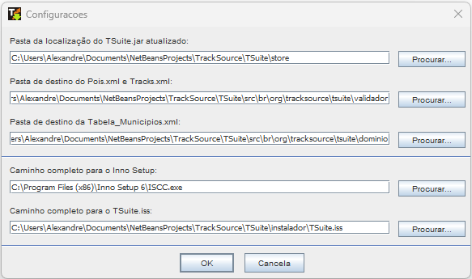

## O que a ferramenta faz?
1. Como se fosse o próprio TSuite, acessa o site e atualiza os arquivos de configurações:
     1.1. base-AUXILIAR-BR.gtm
     1.2. tsuite_update.xml
     1.3. pois.xml
     1.4. tracks.xml
     1.5. tabela_municipios.xml
2. Copia os arquivos de configurações para os devidos destinos, para que seja atualizados no kit gerado pelo Inno Setup:
     2.1. para ...\tsuite\src\br\org\tracksource\tsuite\validador: pois.xml e tracks.xml
     2.2. para ...\tsuite\src\br\org\tracksource\tsuite\dominio: tabela_municipios.xml
     2.3. para ...\tsuite\instalador: base-AUXILIAR-BR.gtm e tsuite_update.xml
3. Gera os dicionários palavras aleatórias para utilização no ofuscador ProGuard. Agora, para cada execução do GeraKitTSuite, um novo conjunto de palavras é gerado o que dificulta ainda mais a quebra do ofuscamente a cada versão do TSuite:
     3.1. ...\tsuite\ofuscador\proguard_dictionary.txt
     3.2. ...\tsuite\ofuscador\proguard_dictionary_class.txt
     3.3. ...\tsuite\ofuscador\proguard_dictionary_pkg.txt
4. Chama o ProGuard para ofusca o TSuite.jar
5. Chama o TSuite, cujo o kit está sendo gerado, na função console "-version" para obter o número da versão
6. Edita e atualiza o arquivo de configuração do Inno Setup (TSuite.iss) para atualizar as informações de versão e data nos parâmetros AppVerName, AppVersion e OutputBaseFilename
7. Executa Inno Setup para geração do kit ...\tsuite\instalador\Output\InstalaTSuite_x.x.x.x.exe
8. Gera a versão zip do kit: ...\tsuite\instalador\TSuite_x.x.x.x.zip, contendo o TSuite.jar, changes.txt, Licenca.txt e Manual_TSuite.pdf

## O que a ferramenta não faz?
A ferramenta não envia os kits automaticamente para o site, não por dificuldade técnica, mas porque é uma boa prática testar os kits gerados quanto ao funcionamento antes de disponibilizar aos usuários.

## Como instalar?
Não há necessidade de instalação. Faça um Update SVN do TSuite que a ferramenta (GeraKitTSuite.jar) será baixado na pasta ...\tsuite\instalador. Aí é só executar o jar como outro programa java qualquer. Mas atenção: o GeraKitTSuite.jar tem que ficar nesta pasta instalador e não pode ser movido para outra pasta.

## Como utilizar?
A utilização é muito simples. Existem apenas duas opções, além do Sair, no menu da ferramenta:
- Configurar: normalmente utilizado apenas na primeira execução para configurar os parâmetros da ferramenta
- Gerar Kit: se todos os parâmetros tiverem sido configurados corretamente, irá gerar os kits.

## Como configurar?
Seguem minhas configurações que podem servir de base para vocês configurarem para o seu ambiente:

## O que mudou no SVN?
O TSuite.jar não é mais guardado ofuscado no SVN na pasta intalador como antes. Agora o TSuite.jar é guardado na pasta ../tsuite/store na versão não ofuscada, pois o ofuscamento passou a ser evocado pela ferramenta.

## Outros pré-requisitos que não estão o SVN
Tudo o que você precisa para executar a ferramenta está disponível no SVN, bastando fazer o update. A exceção é para o programa Inno Setup que precisa ser instalado na sua máquina e o arquivo de configuração do ofuscador ProGuard (extensão .PRO) que é individual para cada pessoa. Atualmente somente eu e o Sérgio possuímos uma versão deste arquivo que fica na pasta ...\tsuite\instalador. Copie um deles (xandao_windows_tsuite.pro, por exemplo) alterando o nome para o seu. Em seguida edite-o e altere as referências as pastas para o seu ambiente.